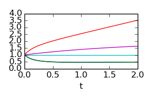

=============================================================================================
INDegrator, an internal numerical differentiation (IND) library of differentiated ODE solvers
=============================================================================================


Description
-----------

    INDegrator is a library of IND integration schemes.

    They allow you to evaluate the solution :math:`x(t; x_0, p, q)` of initial value
    problems (IVP) of the form


    .. math::

        x_t =& f(x, p, q) \\
        x(0) =& x_0

    where :math:`x_t` denotes the derivative of :math:`x` w.r.t. :math:`t`,

    and additionally

    * first-order derivatives

      .. math::

        \frac{\partial x}{\partial x_0}(t; x_0, p, q) \;, \\
        \frac{\partial x}{\partial p}(t; x_0, p, q) \;, \\
        \frac{\partial x}{\partial q}(t; x_0, p, q)

    * and second-order derivatives of the solution

      .. math::

        \frac{\partial^2 x}{\partial x_0^2}(t; x_0, p, q) \;, &
        \frac{\partial^2 x}{\partial x_0 \partial p}(t; x_0, p, q) \\
        \frac{\partial^2 x}{\partial x_0 \partial q}(t; x_0, p, q) \;, &
        \frac{\partial^2 x}{\partial p^2}(t; x_0, p, q) \\
        \frac{\partial^2 x}{\partial p \partial q}(t; x_0, p, q) \;, &
        \frac{\partial^2 x}{\partial q^2}(t; x_0, p, q)


    in an accurate and efficient way.

    The derivatives w.r.t. :math:`x_0`, :math:`p` and :math:`q` are computed based on the IND and automatic differentiation (AD)
    principles. Both forward and reverse/adjoint mode computations are supported.

Rationale
---------

    * For optimal control (direct approach) one requires accurate derivatives of the solution w.r.t. controls ``q``.

    * For least-squares parameter estimation algorithms one requires derivatives of the solution w.r.t. parameters ``p``.

    * For experimental design optimization one requires accurate second-order derivatives of the solution w.r.t. ``p`` and ``q``


Features
--------

    * Explicit Euler, fixed stepsize

         - first-order forward
         - second-order forward
         - first-order reverse

    * Runge Kutta 4 (RK4), fixed stepsize

         - first-order forward
         - second-order forward
         - first-order reverse


Known to work on
----------------

    * Ubuntu 12.04, Tapenade 3.6


Backend
-------

    * Fortran 77

      - the model function is differentiated using Tapenade
      - the generated ``*.f`` files are compiled into ``libproblem.so``
      - the Python module CFFI is used to call the Fortran functions
      - Advantage: very fast execution of the model function and derivatives

    * other backends are also possible

Requirements
------------

    You need Tapenade >= 3.6 to generate the derivatives of the model functions.
    Get it on http://www-sop.inria.fr/tropics/tapenade.html


Getting started
---------------


We consider a chemical reaction kinetics example (Diels-Alder reaction).


.. image:: http://upload.wikimedia.org/wikipedia/commons/thumb/3/3c/Original_Diels-Alder_reaction.png/640px-Original_Diels-Alder_reaction.png
    :align: center
    :scale: 100

The parameters :math:`p` are nature-given and contain unknown quantities such as activation energies and reaction rate constants.
The control functions 

.. math::

    u(t; q) 

are parameterized by the control vector :math:`q`. (Currently only piecewise-linear continuous control functions are possible).

The dynamics are described the the model equations ``ffcn.f``, i.e., the rhs of the ODE:

.. literalinclude:: ../examples/bimolkat/ffcn.f
   :language: fortran


Example 1: zero-order forward
`````````````````````````````

    Compute trajectory :math:`x(t; x_0, p, q)`, i.e., a simple forward evaluation.


    .. literalinclude:: bimolkat_zo_forward.py
        :lines: 1-30




Example 2: first-order forward
``````````````````````````````

    Compute trajectory :math:`\frac{\partial x}{\partial p}(t; x_0, p, q)`
    and :math:`\frac{\partial x}{\partial q}(t; x_0, p, q)`

    .. literalinclude:: bimolkat_fo_forward.py

  .. image:: bimolkat_fo_forward_p.png
    :align: center
    :scale: 100

  .. image:: bimolkat_fo_forward_q.png
    :align: center
    :scale: 100


Example 3: first-order reverse
``````````````````````````````

    Compute the gradients of the state :math:`x(t=2; x_0, p, q)` w.r.t. :math:`x_0, p, q`, i.e.,

    .. math::

        \nabla_{x_0} x(t=2; x_0, p, q) \;, \\
        \nabla_{p} x(t=2; x_0, p, q) \;, \\
        \nabla_{q} x(t=2; x_0, p, q) \;.


    .. literalinclude:: bimolkat_fo_reverse.py

    where one obtains the output::

        gradient of x(t=2; x0, p, q) w.r.t. p  =
        [-0.05553826 -0.26378935 -0.18022685 -0.57068079  0.0912674 ]
        gradient of x(t=2; x0, p, q) w.r.t. q  =
        [[[ -5.88595438e-08   0.00000000e+00]
          [ -5.93303903e-08   0.00000000e+00]
          [ -5.98124990e-08   0.00000000e+00]
          ...,
          [ -1.55170436e-04   0.00000000e+00]
          [ -1.57724384e-04   0.00000000e+00]
          [  0.00000000e+00   0.00000000e+00]]

         [[ -1.91875726e-04   0.00000000e+00]
          [ -1.92256884e-04   0.00000000e+00]
          [ -1.92638781e-04   0.00000000e+00]
          ...,
          [ -1.09278673e-05   0.00000000e+00]
          [ -3.67184216e-06   0.00000000e+00]
          [  0.00000000e+00   0.00000000e+00]]

         [[ -1.88832838e-03   0.00000000e+00]
          [ -1.88832379e-03   0.00000000e+00]
          [ -1.88831907e-03   0.00000000e+00]
          ...,
          [ -4.59399550e-05   0.00000000e+00]
          [ -1.54234950e-05   0.00000000e+00]
          [  0.00000000e+00   0.00000000e+00]]

         [[  2.08733332e-03   0.00000000e+00]
          [  2.08733821e-03   0.00000000e+00]
          [  2.08734323e-03   0.00000000e+00]
          ...,
          [  3.96132167e-03   0.00000000e+00]
          [  3.99233933e-03   0.00000000e+00]
          [  0.00000000e+00   0.00000000e+00]]]
        gradient of x(t=2; x0, p, q) w.r.t. x0 =
        [-0.47113849  0.52078906  0.04958182  0.0499501  -0.04782551]


